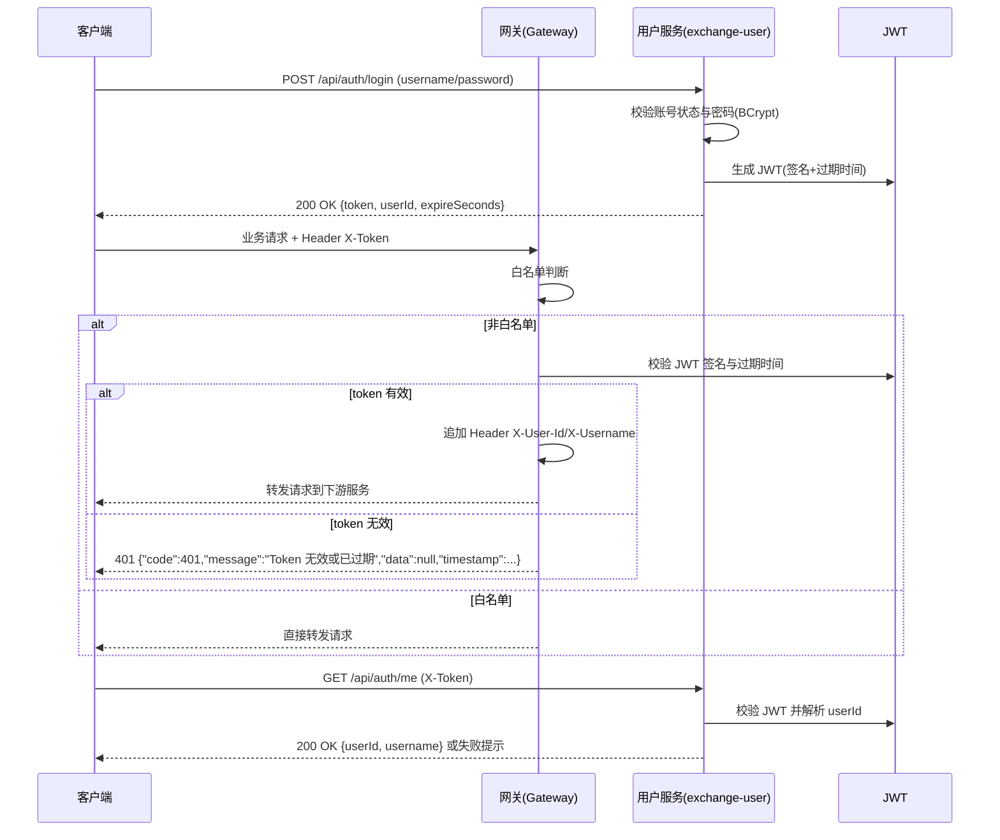

# 登录与鉴权时序图

> 说明：登录签发 JWT，网关统一校验并透传用户身份。

```mermaid
sequenceDiagram
    participant Client as 客户端
    participant Gateway as 网关(Gateway)
    participant UserService as 用户服务(exchange-user)
    participant Jwt as JWT

    %% 登录流程
    Client->>UserService: POST /api/auth/login (username/password)
    UserService->>UserService: 校验账号状态与密码(BCrypt)
    UserService->>Jwt: 生成 JWT(签名+过期时间)
    UserService-->>Client: 200 OK {token, userId, expireSeconds}

    %% 鉴权流程
    Client->>Gateway: 业务请求 + Header X-Token
    Gateway->>Gateway: 白名单判断
    alt 非白名单
        Gateway->>Jwt: 校验 JWT 签名与过期时间
        alt token 有效
            Gateway->>Gateway: 追加 Header X-User-Id/X-Username
            Gateway-->>Client: 转发请求到下游服务
        else token 无效
            Gateway-->>Client: 401 {"code":401,"message":"Token 无效或已过期","data":null,"timestamp":...}
        end
    else 白名单
        Gateway-->>Client: 直接转发请求
    end

    %% /api/auth/me (可选)
    Client->>UserService: GET /api/auth/me (X-Token)
    UserService->>Jwt: 校验 JWT 并解析 userId
    UserService-->>Client: 200 OK {userId, username} 或失败提示
```
