# 阶段26-链上充提币对接（本地链演示）

## 目标
- 部署本地 ERC20 Token 合约
- 打通“链上充值 → 交易所入账”的流程
- 打通“交易所提币 → 链上转账”的流程

## 前置条件
- 本地 EVM 已启动（Hardhat/Ganache 皆可）
- RPC：`http://127.0.0.1:8545`

## 步骤 1：部署 ERC20 合约
合约文件：`infra/solidity/ExchangeToken.sol`

你可以用 Remix 或 Hardhat 部署，示例参数：
- name：`IExchange Token`
- symbol：`IEX`
- decimals：`18`
- initialSupply：`1000000 * 10^18`

部署完成后得到 `tokenAddress`，填入钱包服务配置。

## 步骤 2：配置钱包服务链上参数
配置文件：`exchange-wallet/src/main/resources/application.yml`

关键配置：
- `chain.rpc-url`：本地链 RPC
- `chain.token.address`：合约地址
- `chain.token.symbol`：资产符号
- `chain.hot-wallet.private-key`：热钱包私钥（可留空自动生成）
- `chain.sweep.enabled`：是否开启归集（可选）

提示：
若 `private-key` 留空，服务会自动生成热钱包并写入数据库，
启动日志会输出热钱包地址，请向该地址转入燃料费（ETH）与 Token。
对应记录存于 `wallet_chain_config` 表：
- `hot_private_key`：热钱包私钥
- `hot_address`：热钱包地址

## 步骤 3：申请充值地址（交易所生成）
说明：真实交易所会为用户分配充值地址（地址池），用户不需要提供地址。

```bash
curl -X POST http://localhost:18082/api/wallet/chain/address \
  -H 'Content-Type: application/json' \
  -d '{"userId":1,"chainName":"local"}'
```

## 步骤 4：链上充值（用户转入）
用户将 Token 转到交易所分配的充值地址。

当链上转账确认数满足后，钱包服务会自动入账（扫描任务每 5 秒执行一次）。

## 步骤 5：链上提币（交易所转出）
```bash
curl -X POST http://localhost:18082/api/wallet/chain/withdraw \
  -H 'Content-Type: application/json' \
  -d '{"userId":1,"asset":"IEX","amount":10,"toAddress":"0xYourReceiveAddress","requestId":"withdraw-1001"}'
```

返回的 `txHash` 即链上交易哈希，确认后会扣减冻结资金。

## 说明
- 本阶段为简化版：一个 Token、一个链
- 已使用“交易所生成充值地址”的模式（地址池）
- 生产场景还需要风控、合规、多签、冷热分离、链上监控等能力
- `wallet_chain_address` 记录充值地址与私钥（演示环境明文存储）

## 实现简述（代码说明）
### 结构拆分
- `WalletChainService`：充币扫描与提币确认的主流程。
- `WalletChainClient`：ERC20 交互（查区块、取日志、发转账）。
- `WalletChainAddressService`：生成并管理用户充值地址。
- `WalletChainScheduler`：定时执行充值扫描与提币确认。
- `WalletChainConfigService`：热钱包私钥自动生成与持久化。
- `WalletChainService#sweepDeposits`：归集充值地址余额到热钱包（可选）。

### 充币流程
1) 用户先申请充值地址（交易所生成并保存私钥）  
2) 用户把 Token 转到该充值地址  
3) 定时任务扫描 `Transfer` 日志  
4) 命中充值地址后，调用 `walletService.deposit` 入账  
5) 使用交易哈希 + logIndex 作为幂等请求ID，避免重复入账

### 归集流程（可选）
1) 定时检查充值地址余额  
2) 余额达到阈值后，从充值地址转到热钱包  
3) 热钱包集中管理资产，用于后续提币  
提示：归集地址需要有燃料费（ETH）才能发起转账

### 提币流程
1) 用户发起提币请求  
2) 先冻结余额 `walletService.freeze`  
3) 热钱包发 ERC20 转账并记录 `txHash`  
4) 定时任务确认链上回执后，扣减冻结 `walletService.deductFrozen`

## 流程图

```mermaid
flowchart TD
    subgraph 地址分配
        A[用户申请充值地址] --> B[生成新地址/私钥]
        B --> C[保存到 wallet_chain_address]
    end

    subgraph 充值流程
        D[用户钱包发起 ERC20 转账] --> E[链上 Transfer 事件]
        E --> F[WalletChainScheduler 扫描日志]
        F --> G{是否命中充值地址}
        G -- 否 --> F
        G -- 是 --> H[walletService.deposit 入账]
        H --> I[记录幂等 requestId]
    end

    subgraph 归集流程
        J[WalletChainScheduler 归集任务] --> K[查询充值地址余额]
        K --> L{余额达到阈值?}
        L -- 否 --> J
        L -- 是 --> M[充值地址转账到热钱包]
    end

    subgraph 提币流程
        N[用户提交提币请求] --> O[walletService.freeze 冻结余额]
        O --> P[热钱包发送 ERC20 transfer]
        P --> Q[记录 txHash / SUBMITTED]
        Q --> R[WalletChainScheduler 查询回执]
        R --> S{确认数满足?}
        S -- 否 --> R
        S -- 是 --> T{交易成功?}
        T -- 否 --> U[walletService.unfreeze 解冻]
        T -- 是 --> V[walletService.deductFrozen 扣减冻结]
    end
```

