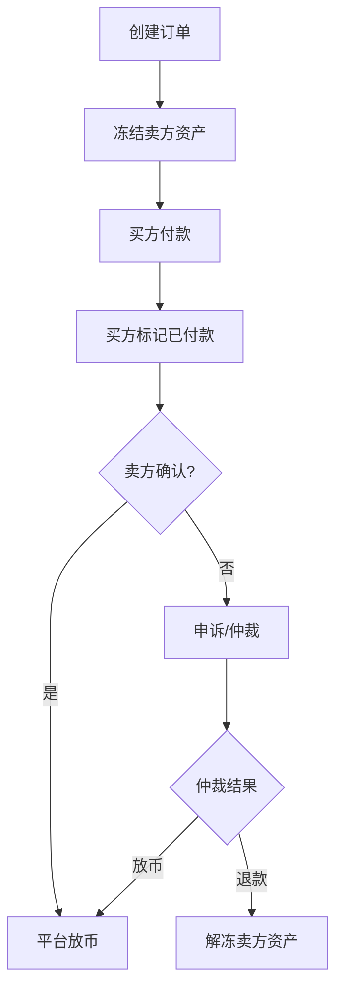

# 阶段27-OTC法币交易设计思路

## 目标
- 理清 OTC（C2C）买/卖 USDT 的资金托管与放币机制
- 明确“强制放币”是平台账本内的处理
- 给出最小可运行的示意代码结构

## 核心原则
- **OTC 只操作平台内部账本**，链上只负责充值/提币
- 下单时先**冻结卖方资产**，避免卖方拒不放币
- 放币/退款由平台裁决，属于**账本划转**

## 关键对象
### 订单状态（示例）
- `WAIT_PAY`：等待买方付款
- `WAIT_RELEASE`：买方已付款，等待卖方放币
- `DONE`：放币完成
- `CANCELED`：取消或仲裁退款

### 资金动作（对应钱包服务）
- 冻结：`walletService.freeze`
- 放币：`walletService.deductFrozen + walletService.tradeIn`
- 退款：`walletService.unfreeze`

## 买币流程（买方）
1) 买方下单，平台冻结卖方 USDT  
2) 买方线下转法币给卖方  
3) 买方标记已付款（进入待放币）  
4) 卖方确认收款 → 平台放币给买方  
5) 若纠纷，平台仲裁后强制放币或退款

## 卖币流程（卖方）
1) 卖方挂单或接受买方订单  
2) 平台冻结卖方 USDT  
3) 买方付款  
4) 卖方确认 → 平台放币  
5) 若买方未付款 → 超时取消并解冻

## “强制放币”如何实现
- 买方确认付款后若卖方不放币，平台可发起仲裁  
- 仲裁确认后，平台直接在账本中：
  - 扣减卖方冻结余额  
  - 增加买方可用余额  
- 这不涉及链上强制转账，链上资产早已由交易所托管

## 与链上的关系
- 链上只处理：充值/提币  
- OTC 交易只改变内部余额，不发生链上转账  
- 用户看到的余额来自交易所账本，而非链上余额

## 数据表（示意）
- `otc_order`：订单基础信息与状态流转
- `wallet_flow`：资金流水（冻结/解冻/放币）

## 风控与超时（简化示意）
- 买方超时未付款 → 订单取消，解冻卖方资产  
- 卖方超时未放币 → 触发申诉/仲裁  
- 反洗钱/黑名单/限额属于扩展能力

## 配置（演示）
配置文件：`exchange-wallet/src/main/resources/application.yml`
- `otc.enabled`
- `otc.scan-interval-ms`
- `otc.pay-timeout-minutes`
- `otc.release-timeout-minutes`

## 接口示意
- `POST /api/wallet/otc/order` 创建订单
- `POST /api/wallet/otc/order/paid` 买方标记已付款
- `POST /api/wallet/otc/order/release` 放币
- `POST /api/wallet/otc/order/cancel` 取消订单
- `GET /api/wallet/otc/order` 查询订单
- `GET /api/wallet/otc/order/list` 查询用户订单

## 示意代码
- `exchange-wallet/src/main/java/com/iexchange/wallet/otc/OtcOrderService.java`
- `exchange-wallet/src/main/java/com/iexchange/wallet/controller/OtcOrderController.java`
- `exchange-wallet/src/main/java/com/iexchange/wallet/otc/OtcOrderScheduler.java`

## 流程图

